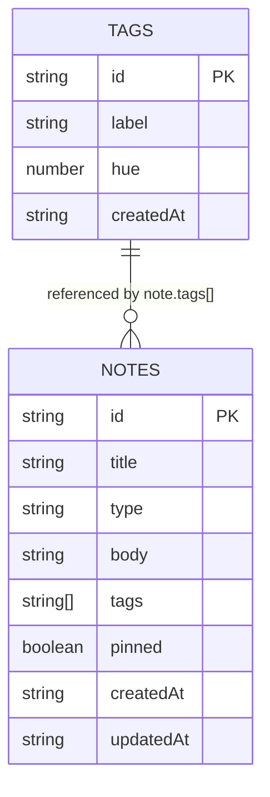
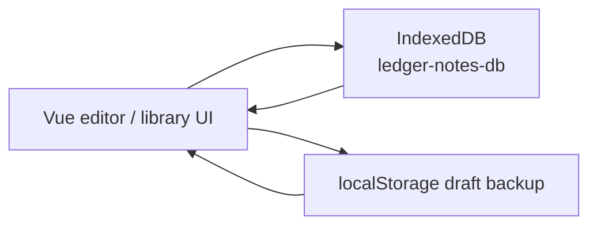

# IndexedDB Diagram

This app stores note data locally in IndexedDB using the `idb` wrapper in [src/db.js](C:\Users\Hengty(Jack)Eang\OneDrive - SkyAus Infrastructure Pty Ltd\Desktop\Self Induction\Claude app\Note app\src\db.js).

## Overview

- Database name: `ledger-notes-db`
- Version: `1`
- Object stores:
  - `notes`
  - `tags`
- Primary relationship:
  - each note stores an array of tag IDs in `note.tags`
  - tags do not store back-references to notes

## Mermaid ER Diagram

## Store Details

### `notes`

- Key path: `id`
- Indexes:
  - `updatedAt`
  - `pinned`
  - `type`
- Notes:
  - `body` stays a string
  - older notes may contain plain text
  - newer edited notes may contain HTML rich-text content
  - `tags` stores tag IDs, not full tag objects

### `tags`

- Key path: `id`
- Indexes:
  - `label`

## Runtime Data Flow

## Save Behavior Notes

- IndexedDB is the canonical data store.
- `localStorage` is used only as a temporary draft-recovery layer for recent unsaved note edits.
- Deleting a tag also updates notes in the same transaction by removing that tag ID from any note that references it.
